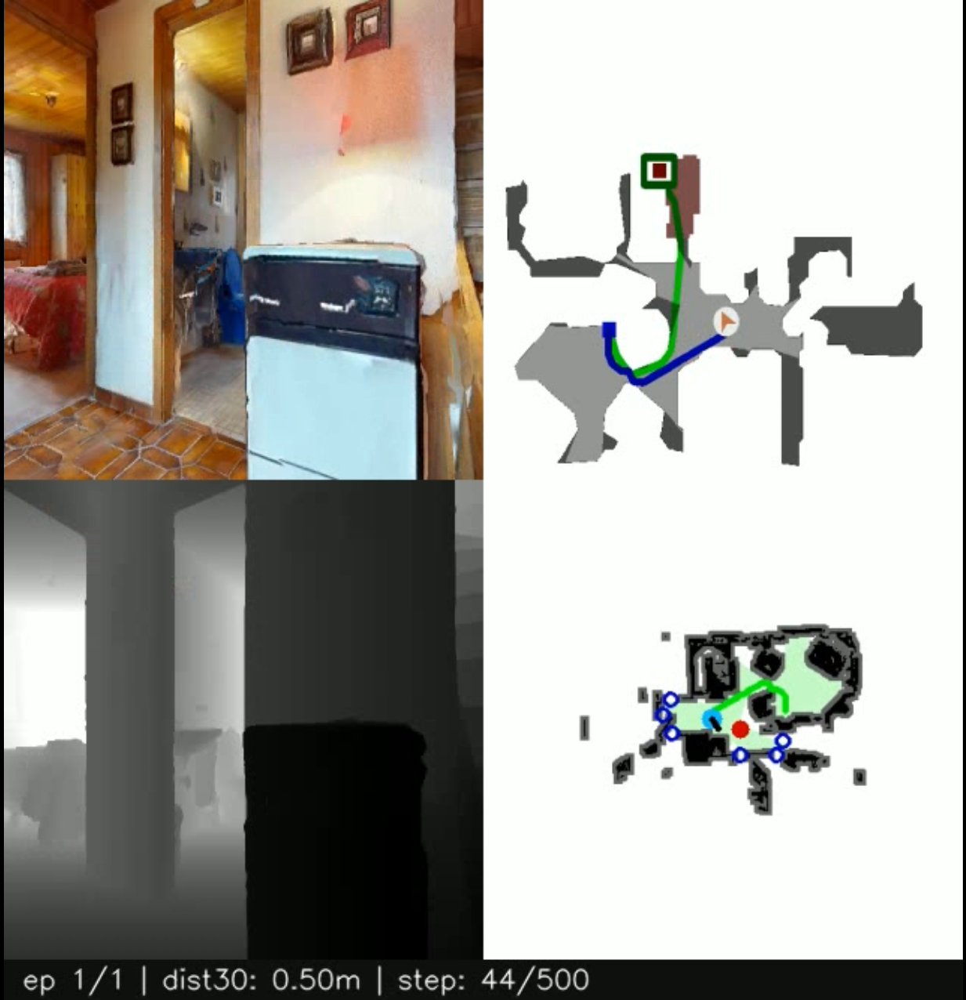
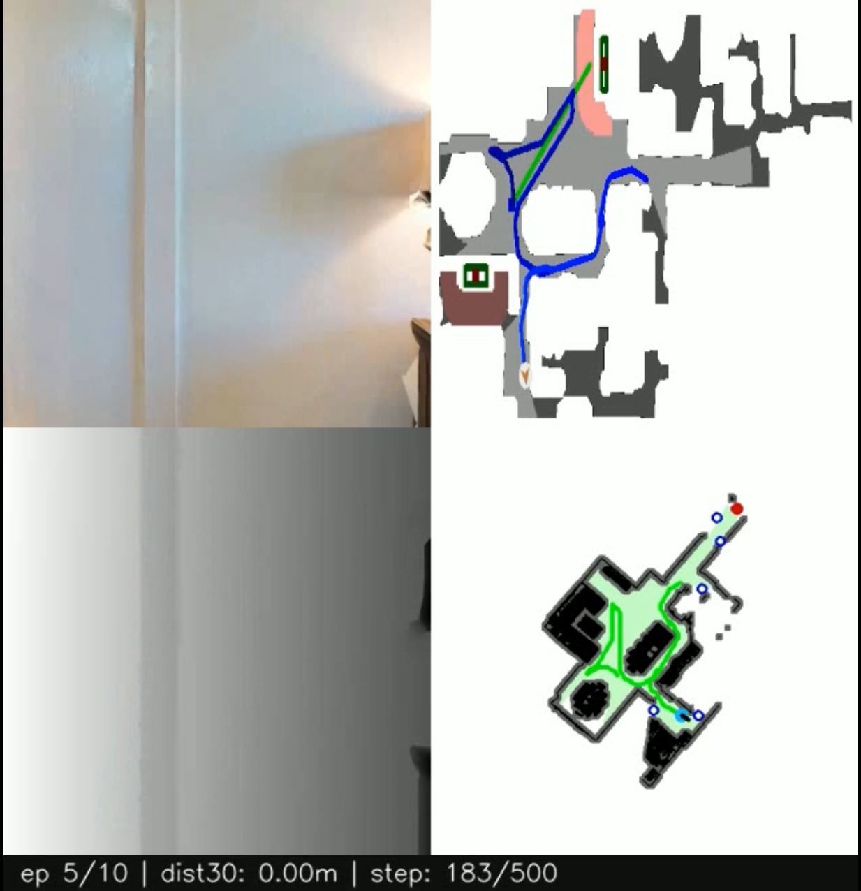
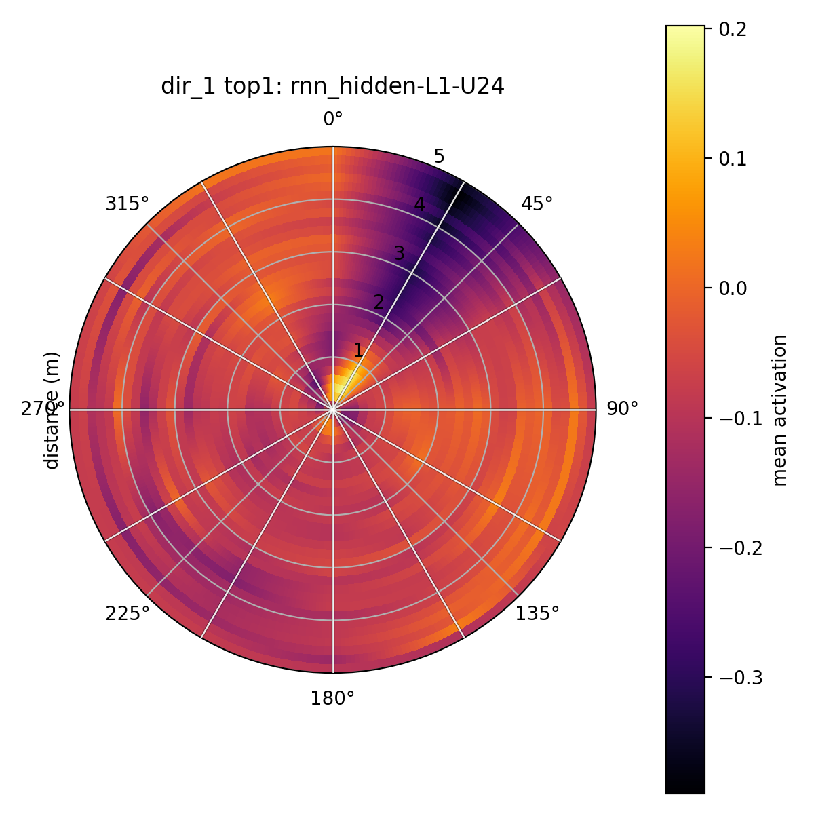
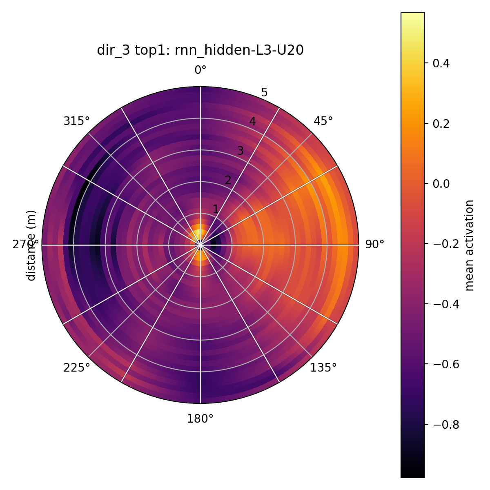
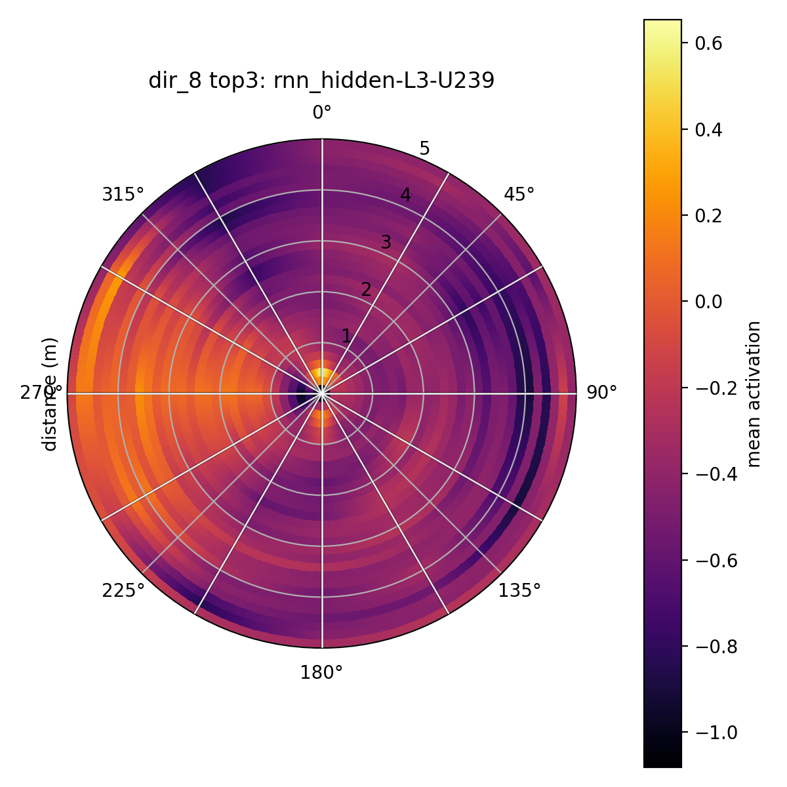

# PointNav 导航模型中的自我中心空间表征与障碍物记忆机制分析

**课程名称**：系统与计算神经科学

**小组成员与分工**：

* **彭程（组长）**：项目统筹；代码编写；做实验；报告撰写与可视化整理。
* **钟逸**：负责理论架构设计；代码逻辑审计；学术综述与文献规范
* **高翔**：负责完善实验过程；记录、分析实验结果；实验结果与讨论部分规范化
* **冯宇鹏**： 负责实验设计与分析方法部分；修改报告第2,3部分以及格式微调；讨论实验与分析方法

## 1. 动机与背景

### 1.1 研究动机
在系统与神经计算科学的研究范式中，空间导航不仅是一项复杂的行为任务，更是研究大脑如何编码外部世界的窗口。其中，大脑如何通过神经元放电从而构建出精确的空间度量，一直是该任务探索的核心问题之一。**本研究的理论动机源于 Banino 等人在 2018 年发表于《Nature》的研究《Vector-based navigation using grid-like representations in artificial agents》[1]**。该研究通过构建基于长短期记忆网络（LSTM）的循环架构，模拟了生物脑处理运动学信号的过程；同时实验结果表明在执行路径积分任务时，模型内部会自发涌现出具有六边形周期性特征的类网格单元，而这一特性与哺乳动物内嗅皮层中支持空间导航的“网格细胞”高度相似。这一结论揭示了网格细胞在空间导航中的计算逻辑，证明了深度强化学习模型能够作为模拟空间认知的有效计算工具 。

本研究在此基础上，选取了基于VLFM（Visual Language Frontier Maps）预训练背景的**PointNav**模型作为研究对象 [2]。虽然 VLFM 的设计初衷是处理复杂的物体导航任务，但本研究收敛至点对点导航任务，以此排除高层语义的干扰，从而能够更纯粹地观察模型在处理环境几何拓扑与障碍物规避时的逻辑。利用这一模型，本研究试图探讨人工神经元如何在PointNav任务约束下演化出具有特定功能指向性的计算单元。

### 1.2 相关工作
本研究在理论框架上融合了多项跨学科的成果。关于认知地图的构建逻辑，本研究参考了 **Whittington 等人 (2022)在《Nature Neuroscience》** 上的综述 [3]，该文献系统阐述了哺乳动物大脑皮层中的海马体-内嗅皮层系统如何利用结构化表征将空间经验转化为可泛化的规律，为理解模型在不同环境下保持导航一致性提供了理论基础。在解析特定神经元的功能属性时，本研究借鉴了 **Zhou 等人 (2018)《PNAS》** 上提出的网络单元功能解析思想 [4]，即神经网络内部的部分单元往往会演化为特定概念的检测器。

这一机制的普适性在 **Sorscher 等人 (2023)** 关于网格细胞起源的统一理论中得到了进一步验证：该研究指出，生物化表征的涌现并非偶然，而是特定网络结构在优化空间编码效率时的必然选择 [5]。这一理论为本研究在 PointNav 模型中搜寻避障特化单元提供了依据，也就是说即使任务层级不同，底层的空间感知约束仍会驱动功能性神经元的产生。最后，在工程实现层面，**Tai 等人 (2017)** 证明了利用传感器信息进行端到端导航的有效性 [6]，而 **Fan 等人 (2020)** 关于分散式避障的研究则启发了本研究对模型在动态环境下决策一致性的分析逻辑 [7]。上述这些工作共同构成了本研究从理论基础到项目实践的基础文献。

### 1.3 核心目标
本研究的核心目标并不是追求导航任务的成功率，而是利用统计学手段挖掘模型内部针对导航任务的避障机制。实验效仿神经科学中对特定功能神经元的搜寻逻辑，在模型运行过程中同步观测并采集隐层神经元的激活状态，同时在实验阶段引入了斯皮尔曼相关性分析与线性回归模型对神经元活动进行机制解析。

更进一步说，实验过程旨在通过数据采样量化隐层神经元的激活状态与环境障碍物空间分布（如方位角、距离）之间的耦合程度并将其可视化，从而识别出在避障决策中起主导作用的神经元。在这一工作中，我们尝试将模型从感知到行动的复杂过程拆解开来，分析其内部处理机制，尤其关注模型内部是否形成了对空间障碍物等特定信息敏感的神经元。通过对模型认知机制进行追溯，我们可以理解更大规模、更复杂空间模型的内部工作原理。

## 2. 实验设置与数据采集

### 2.1 仿真环境与轨迹生成

实验在 Habitat 仿真框架下运行，选取 HM3D 的多样室内场景作为测试集，并借用了 ObjectNav 任务的初始位姿与场景分布以保证环境复杂性。为了避免标准 PointNav 任务中“直奔目标”带来的目标偏置，研究使用了一个基于障碍边界的随机前沿（`Random Frontier`）规划器（实现位于 `neural/planner/random_frontier_planner.py`）。该规划器先基于 `ObstacleMap` 识别已探索与未探索区域的前沿（frontier），再从可达的 frontier 中随机挑选临时目标，驱动 agent 持续走动与转向，从而在采样时覆盖更多方位与距离组合，生成更丰富的障碍物-状态分布，便于后续对表征的解读。

<table>
  <tr>
    <td></td>
    <td></td>
  </tr>
  <tr>
    <td colspan="2" align="center">
      <b>模拟器运行示例</b>
    </td>
  </tr>
</table>

### 2.2 障碍物检测

环境感知方面，每一步通过 `ObstacleMap.raycast_obstacle_distances()` 在 agent 周围均匀发出 12 条射线（默认最大检测范围为 5m），记录每条射线命中的最近障碍距离，得到形如 `N×12` 的距离真值矩阵。12 个方向从正前方开始按顺时针编号（`dir_0` 为正前方，`dir_3` 为正右方，`dir_6` 为正后方，`dir_9` 为正左方），这一角度定义与 `neural/mapping/obstacle_map.py` 中保持一致。为区分视觉可见性，基于相机的水平视场角（HFOV）在这 12 个方向上生成可见性掩码；在当前结果配置下，通常把 `dir_0`、`dir_1`、`dir_11` 归为视野内（on-screen），其余 9 个方向视为视野外（off-screen），便于比较视觉输入直接参与与依赖内部记忆两类表征的差异。

### 2.3 模型架构与“探针点”

模型采用 VLFM 提供的预训练  `PointNavResNetPolicy` checkpoint，将网络内部表示拆分为三类并记录下来构成总共 `3072` 维的“探针”特征：视觉嵌入（`visual embed`，`512` 维，对应“眼睛看到什么”）、LSTM 隐状态（`rnn hidden`，`4×512=2048` 维，包含两层 LSTM 的 `h` 与 `c`）以及 RNN 输出（`rnn output`，`512` 维，更接近动作决策信号）。实验在大规模采样下运行（分析结果样本量为 `N=366018`），这些真实标签与内部激活共同构成了后续分析的数据基础，相关脚本与结果文件（如 `result/analysis_out_hidden/config.json`、`screened_neurons.json` 等）记录了具体配置与中间产物，便于复现与进一步检验。

---

## 3. 分析方法

<table>
    <tr>
        <td>
            
        </td>
        <td>
            
        </td>
        <td>
            
        </td>
    </tr>
    <tr>
        <td align="center">对约一点钟方向 负反应的神经元</td>
        <td align="center">对约三点钟方向 正反应的神经元</td>
        <td align="center">对约八点钟方向 正反应的神经元</td>
    </tr>
</table>

考虑到数据量大 (当前结果的样本数 `N=366,018`，见 `result/analysis_out_hidden/config.json`)原始特征维度高且关系不一定是线性的，我们采用了两阶段的线性探针流程以兼顾可解释性与统计稳健性。
### 3.1 Spearman 相关性筛选
第一阶段以 Spearman 相关系数对每一方向（`dir_k`）进行筛选：计算每个神经元激活与该方向真实距离之间的 Spearman 相关（使用 `neural/models/spearman.py`），按绝对相关值排序并保留 Top-50，且只保留 `abs(corr) ≥ 0.2` 的单元。之所以选择 Spearman，是因为距离与激活的关系往往表现为单调但非严格线性，Spearman 对此更为鲁棒。筛选结果会被写入 `screened_neurons.json`，其中同时包含特征元信息（`part/layer/unit`），方便精确定位每个高相关单元的来源。
### 3.2 Lasso回归 (L1 线性探针)
第二阶段采用 Lasso（L1 线性回归）对每个方向的筛选特征进行拟合（实现位于 `neural/models/lasso.py`），以线性模型估算方向距离并输出定量指标（如 `mae`、`n_features` 等）。在这里，`n_features` 指的是进入 Lasso 的候选特征数（上限 50），而最终的稀疏化权重可以从 `lasso_weights.npy` 中统计非零项以获得真正的有效特征数。使用 Lasso 的目的是在保持可解释性的同时抑制共线性并突出少数线性贡献显著的神经元，从而形成可检验的假设：哪些层级或哪类表示（`visual/hidden/output`）更倾向于编码特定方向的距离信息。
### 3.3 Top-3 代表性神经元汇总

为进一步把握“该方向到底依赖哪些来源”的问题，我们在跨来源的层面上汇总了 top-3 的代表性神经元：先将来自 visual、hidden、output 三类的筛选结果合并，再按照 Lasso 的 MAE 排序提取表现最好的组合，输出 merged_summary.csv（由 result/analyze.py 生成）。这种混合汇总允许我们回答更细化的问题，例如视野内表征是否更依赖浅层视觉特征，视野外是否更多倚重深层的隐状态或输出层记忆单元。整个两阶段流程既给出定量的拟合精度，也便于将定量发现与网络架构的层级、功能分工直接关联，从而为后续的机制性解释与神经科学类比提供可操作的证据链。

---

## 4. 实验结果与观察
### 4.1视野内与视野外系统差异
基于第3.3节的模型输出结果，本研究对障碍物处于智能体视野内部与外部的系统表征进行了定量比较，具体聚焦于以下四个关键参数：

1. MAE平均绝对误差：视野内障碍物的平均MAE为0.621，而视野外障碍物的平均MAE为0.903，表明视野外状态的预测误差显著更高。
2. `n_features`入模特征数：视野内场景建模平均动用了50.0个特征，而视野外场景平均仅调用29.78个特征，说明视野外信息的特征利用率显著降低。
3. 该方向Top-3影响力神经元的平均层号：以各方向中影响力排名前三的神经元为例，视野内这些神经元的平均层号为1.89，视野外则深至3.44，反映出视野外信息处理涉及更深的网络层次。
4. 该方向Top-3影响力神经元的平均相关强度：视野内相关强度均值为0.594，视野外则降至0.321，说明视野外关键神经元的激活强度明显减弱。

综合上述量化差异，可做如下解读：视野内的障碍物信息呈现“视觉主导”的表征特性，其处理更依赖于前馈、浅层的视觉特征，特征密集且直接与感知输入相关。相对地，视野外的障碍物信息则体现出“记忆-推断”的表征模式，依赖更深层的网络进行信息整合与推理，特征更为稀疏，且可能与内部状态、历史信息或空间推理机制相关联，但其表征依然在系统中存在并可被检测。

### 4.2视野外预测情况
尽管视野外障碍物的预测性能整体上逊于视野内情形，但其预测并非完全不可实现。以下两项实验证据支持视野外障碍仍具备一定的可预测性：
1. 在部分视野外方向中，系统仍能筛选出大量相关神经元（`n_features`达到上限50），并将平均绝对误差维持在可接受的中等水平，这说明模型在某些外部区域仍保留了较高的特征表达与推断能力。
2. 在一些盲区方向（如 `dir_4`、`dir_8`、`dir_10`）的影响力排名前三的神经元中，出现了位于输出层或邻近输出层的神经元，这一现象暗示相关信息可能经由循环神经网络（RNN）的时序决策通路逐步传递并“沉淀”至高层，进而影响最终输出，从而为视野外推断提供了网络内部的信息证据。

这些结果表明，即使缺乏直接视觉输入，系统仍能通过内部状态与记忆机制对视野外环境进行一定程度的建模与推断，这意味着即便是简单的PointNav模型，其内部也存在着对于所处环境的隐式记忆。
 

### 4.3各方向汇总表
下表是各个方向按MAE升序排列的实验结果。

| dir | top3_sources | top3_abs_corr_mean | top3_layer_mean | mae | n_features |
| --- | --- | --- | --- | --- | --- |
| dir_1 | hidden,hidden,visual | 0.5716 | 1.33 | 0.5744 | 50 |
| dir_11 | hidden,hidden,visual | 0.5666 | 2.00 | 0.6051 | 50 |
| dir_0 | hidden,hidden,hidden | 0.6437 | 2.33 | 0.6843 | 50 |
| dir_2 | hidden,hidden,hidden | 0.4460 | 3.33 | 0.7458 | 50 |
| dir_10 | hidden,hidden,output | 0.4224 | 3.67 | 0.7790 | 50 |
| dir_3 | hidden,hidden,hidden | 0.3347 | 2.67 | 0.8378 | 47 |
| dir_9 | hidden,hidden,hidden | 0.3456 | 3.67 | 0.8680 | 44 |
| dir_4 | hidden,output,hidden | 0.2569 | 3.67 | 0.9008 | 9 |
| dir_8 | hidden,hidden,output | 0.2716 | 3.67 | 0.9312 | 6 |
| dir_7 | hidden,hidden,hidden | 0.2228 | 3.00 | 0.9985 | 8 |
| dir_6 | hidden,hidden,hidden | 0.3836 | 3.67 | 1.0243 | 50 |
| dir_5 | hidden,hidden,hidden | 0.2057 | 3.67 | 1.0413 | 4 |

除了上述几节的讨论外，值得注意的是dir_2和dir_10等不完全可见的方向上，探针预测准确度也较高。这可能是由于其在记忆中时间戳较新，使得重建信息较为容易。另外一种可能是，前方的障碍物信息对于导航避障来说更有用，因此模型在训练中相对于后方障碍，更倾向于保留前侧方障碍的记忆。

## 5. 讨论探究
若经典的“祖母细胞”假说在本研究涉及的导航任务中成立，我们预期应观察到如下现象：在智能体空间感知的某些特定方向上，会存在极少数、甚至单一的高度特异化神经元，其激活状态与该方向上的障碍物距离呈现出极强的（接近于1的）、近乎决定性的相关关系（即可读性）；并且，模型的预测与决策输出应主要依赖于这类稀疏的“关键神经元”。
然而，本实验所获结果与上述预期存在系统性偏差，呈现出以下显著特征：
1. 神经元响应的非极端性与分布式编码特征：分析显示，任何单一神经元与障碍物距离的相关性均未达到极端水平（最高值约为0.66）。这表明，不存在任何单个神经元能够独立、完备地编码特定方向的障碍信息，反驳了“单一神经元即足以完成表征”的极端特异化编码模式。
2. 表征丰富度与预测精度呈正相关：模型的预测性能与参与编码的神经特征数量密切相关。在预测误差较低的方向（如典型的视野内场景，其n_features常达到上限50），往往伴随着大量特征被协同调用。反之，当特征表征极为稀疏时（例如`dir_5`方向仅筛选出4个特征），则对应着最大的预测误差（MAE）。这暗示，良好的预测性能依赖于一个丰富且协同工作的特征群体，而非少数孤立的高响应单元。
3. 信息整合呈现跨层级与跨模块特性：影响力排名前三（Top-3）的神经元广泛分布于网络的不同处理模块与层级（包括隐藏层、视觉编码层及输出层）。这一分布模式表明，障碍物空间信息的表征并非定位于某个孤立的、“结论性”的神经元，而是网络整体计算动力学与群体神经元活动的自然结果，体现了信息在感知、记忆整合与决策生成等多个处理阶段间的流动与综合。

综上所述，本研究的实证证据更倾向于支持一种 “部分细胞分布式群体编码” 机制，而非高度特异化的“祖母细胞”编码机制。在PointNav智能体中，对于障碍物（尤其是视野外障碍）的“记忆”与推断，并非依赖于某个或某几个专用的记忆单元，而是通过一个广泛分布的神经元群体，以集体计算或动态共识的机制“涌现”而来。这种表征方式可能赋予了系统更强的鲁棒性、灵活性以及对不完全信息的处理能力，与复杂认知任务中观察到的神经网络分布式处理原则相一致。

---

## 6. 复现方式

请参考 [复现流程](./Reproducible_Pipeline.md) 了解更多。

## 参考文献 (References)
* [1] Banino A, Barry C, Uria B, et al. Vector-based navigation using grid-like representations in artificial agents[J]. Nature, 2018, 557(7705): 429-433.
* [2] Yokoyama N, Ha S, Batra D, et al. Vlfm: Vision-language frontier maps for zero-shot semantic navigation[C]//2024 IEEE International Conference on Robotics and Automation (ICRA). IEEE, 2024: 42-48.
* [3] Whittington J C R, McCaffary D, Bakermans J J W, et al. How to build a cognitive map[J]. Nature neuroscience, 2022, 25(10): 1257-1272.
* [4] Bau D, Zhou B, Khosla A, et al. Network dissection: Quantifying interpretability of deep visual representations[C]//Proceedings of the IEEE conference on computer vision and pattern recognition. 2017: 6541-6549.
* [5] Sorscher B, Mel G, Ganguli S, et al. A unified theory for the origin of grid cells through the lens of pattern formation[J]. Advances in neural information processing systems, 2019, 32.
* [6] Tai L, Paolo G, Liu M. Virtual-to-real deep reinforcement learning: Continuous control of mobile robots for mapless navigation[C]//2017 IEEE/RSJ international conference on intelligent robots and systems (IROS). IEEE, 2017: 31-36.
* [7] Fan T, Long P, Liu W, et al. Fully distributed multi-robot collision avoidance via deep reinforcement learning for safe and efficient navigation in complex scenarios[J]. arXiv preprint arXiv:1808.03841, 2018.
